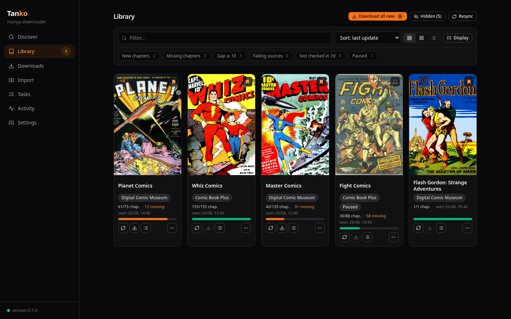
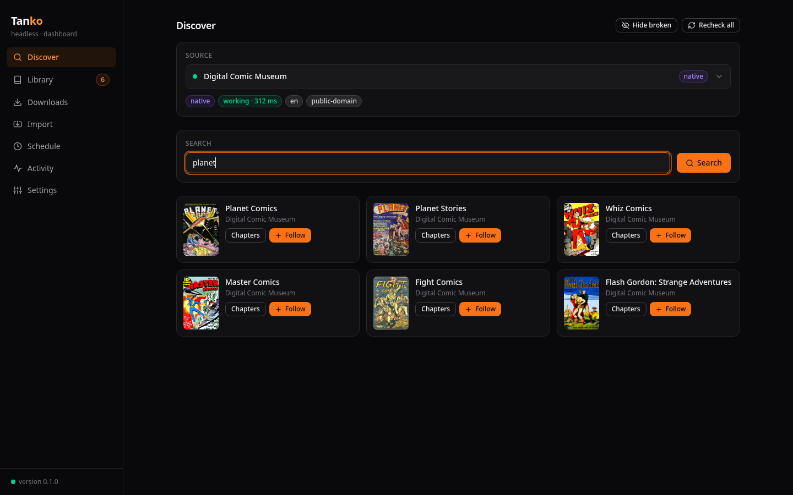
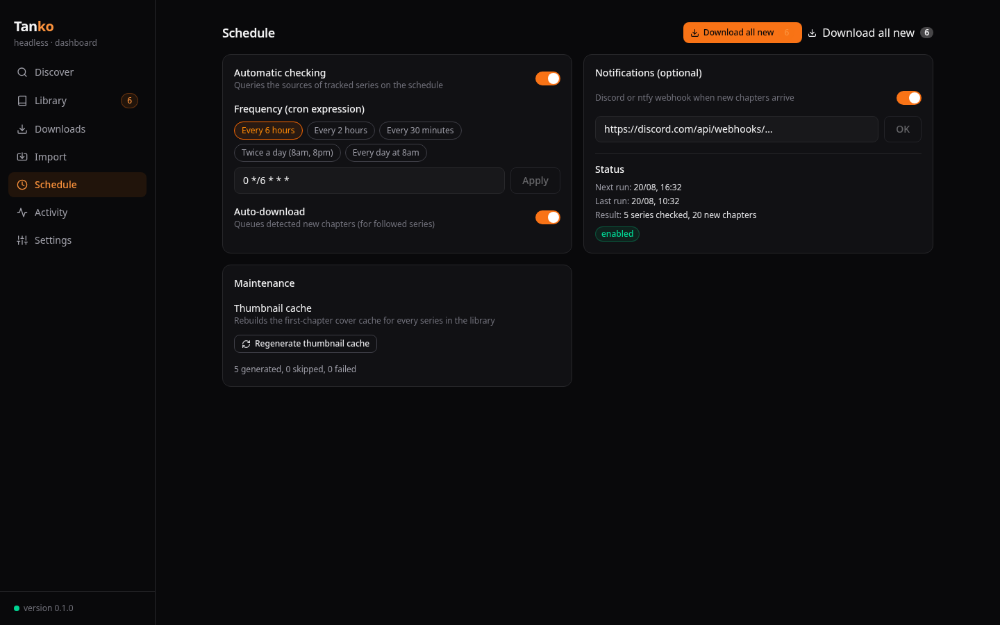

# Tanko

Tanko is a headless manga and manhwa downloader and tracker with a web
dashboard. It is based on the engine of
[HakuNeko](https://github.com/manga-download/hakuneko), whose source
connectors it reuses, kept up to date automatically. It works like a
Sonarr for manga: follow series, detect new chapters, download them
automatically, and get notified.

| | |
|---|---|
|  |  |
|  | |

## Features

- Automatic source list synced from HakuNeko, with health checks
- Sonarr-like library: follow series, auto-download new chapters
- Persistent download queue with retries and rate limiting
- CBZ or image folder output, HakuNeko-compatible layout
- Dark web dashboard (English/French) with live updates
- Optional first-chapter thumbnails cached locally
- Cron scheduler with Discord/ntfy notifications
- Existing library import and source failover

## Quickstart (Docker)

```bash
cp docker-compose.yml.example docker-compose.yml
docker compose up -d --build
```

The dashboard is at http://localhost:8080. All data (SQLite database,
settings, downloaded library) lives in `./data`, mounted as `/data` in the
container.

Podman works too: the image is OCI-compatible, `podman build -t tanko .` or
`podman-compose up -d` with the same compose file.

## Configuration

Chapter format, download parallelism (parallel sources × chapters per
source), throttle and preferred languages are user settings: change them
anytime in the dashboard's Settings tab, they are persisted in the database.
user settings: change them anytime in the dashboard's Settings tab, they
are persisted in the database.

Environment variables, set in `docker-compose.yml` (deployment only):

| Variable | Default | Description |
|---|---|---|
| `PORT` | `8080` | HTTP port of the service |
| `CONNECTORS_AUTO_RESTART` | `1` | restart after a source sync to load new connectors; `0` disables |
| `IMPORT_PATH` | (empty) | container path of an existing library to import at startup |
| `IMPORT_AUTO_CONFIRM` | `auto` | `auto` confirms reliable matches, `all` confirms everything, `none` requires manual validation |
| `IMPORT_AUTO_DOWNLOAD` | `0` | `1` makes imported series auto-download future chapters |
## Development

Requires Node.js >= 22.

```bash
npm install
npm run build
DATA_DIR=./data node packages/server/dist/index.js
```

With hot reload:

```bash
npm run dev
```

Tests:

```bash
npm test
```

## Monorepo layout

```
packages/
├── shared/     # shared DTO types (REST + WebSocket)
├── core/       # headless engine + connectors
│   └── vendor/ # HakuNeko connectors, synced automatically
├── server/     # Fastify + SQLite (node:sqlite), download queue, scheduler
└── dashboard/  # Vite + React + Tailwind, dark theme, EN/FR
```

## Notes

- The legacy connectors come from the HakuNeko repository. Some sites have
  changed or block scraping. The health check and the working-sources filter
  help sort it out. Key sites can be added as native connectors in
  `packages/core/src/sources/native/`.
- Respect the source sites: throttling is enabled by default, avoid overly
  frequent checks.

## License

MIT, see [LICENSE](LICENSE). The HakuNeko connectors in
`packages/core/vendor/` are public domain (Unlicense), see the upstream
repository for details.
